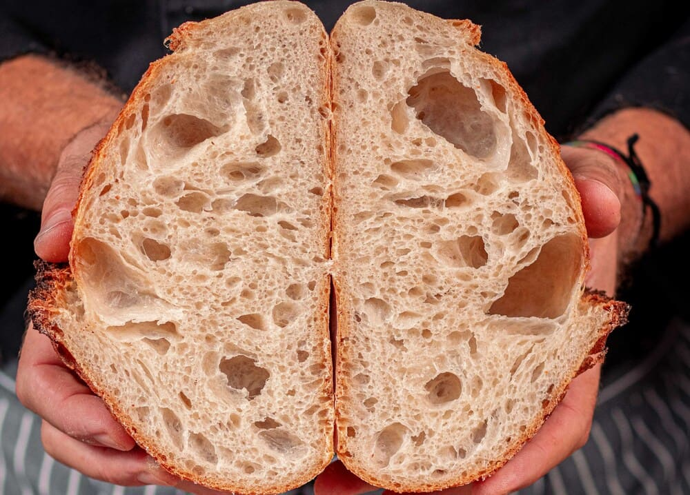

# Guía de estilos — Sección "Cards" (galería de panes)

## 1. Resumen

El snippet corresponde a la **galería de tarjetas de panes** (`cards.html` + `css/cards.css` + `js/*`). Cubre una única sección: una cuadrícula de tarjetas que muestran una fotografía y, al pasar el mouse, se expanden para revelar el título y la descripción del pan.

Estilo visual general: **minimalista y cálido**, con una paleta de ámbar como acento, bordes finos redondeados y fotografías de producto. La tipografía no está definida en el snippet (hereda los valores del navegador).

> Nota: no falta ningún archivo necesario (HTML, CSS y JS están presentes). Lo que no está definido —tipografía, breakpoints— se marca como `No determinado` o `Sugerencia`.

---

## 2. Fundamentos

### 2.1 Colores

| Token | Valor HEX | Uso | Dónde aparece |
|---|---|---|---|
| `--color-llamada` | `#fbbb25` | Borde de la tarjeta en reposo (ámbar) | `cards.css:27` (`--amber-flame`) |
| `--color-acento` | `#f9a019` | Borde de la tarjeta en hover | `cards.css:56` (`--amber-glow`) |
| `--color-base` | `#fefffe` | Fondo principal (blanco) | `cards.css:20` (`--white`, **declarado, sin uso**) |
| `--color-suave` | `#e9ebf8` | Fondo suave (lavanda) | `cards.css:21` (`--lavender`, **declarado, sin uso**) |
| `--color-detalle` | `#b4b8c5` | Detalle / texto secundario | `cards.css:22` (`--pale-slate`, **declarado, sin uso**) |
| *(literal)* | `white` | Fondo de la tarjeta | `cards.css:33` (`background-color: white`) |

- Los tres primeros colores (`base`, `suave`, `detalle`) están **declarados pero no se usan** en esta hoja: quedan como paleta reservada para el resto del proyecto.
- El fondo de la tarjeta usa el literal `white` en lugar del token `--color-base`.
- Contraste: no se define color de texto; el texto hereda el negro por defecto del navegador, que sobre fondo blanco (`#fefffe`) y lavanda (`#e9ebf8`) tiene contraste adecuado. `No determinado` para el resto.

### 2.2 Tipografía

| Rol | Elemento | Familia | Tamaño | Grosor | Interlineado |
|---|---|---|---|---|---|
| Título de tarjeta | `h4` | `No determinado` (hereda navegador) | `No determinado` (~0.83 em por defecto) | hereda negrita | `No determinado` |
| Párrafo de tarjeta | `p` | `No determinado` (hereda navegador) | `No determinado` | hereda normal | `No determinado` |

- **No se declara** `font-family`, `font-size` ni `color` de texto en todo el snippet: todo hereda del navegador.
- Única regla tipográfica presente: el título `h4` lleva `margin: 0` (`cards.css:64`).
- `Sugerencia`: definir una familia base (con fallback) y una escala (título ~2–2.5× el texto base) en un `:root` compartido.

### 2.3 Espaciado

| Token propuesto | Valor (rem) | Equivalente px | Valores originales agrupados | Dónde |
|---|---|---|---|---|
| `--espacio-s` | `0.625rem` | 10px | `padding: 10px` | `cards.css:61` |
| `--espacio-l` | `1.875rem` | 30px | `gap: 30px` | `cards.css:79` |
| `--espacio-none` | `0` | 0 | `margin: 0` (h4) | `cards.css:64` |
| — | `auto` | auto | `margin: auto` (centrado de la galería) | `cards.css:69` |

- No hay escala definida: solo dos valores de padding/gap distintos. El más usado es el **padding de 10px** (`--espacio-s`).
- `Sugerencia`: completar la escala con al menos `--espacio-xs` (4px), `--espacio-m` (16px) y `--espacio-xl` (48px) cuando el resto del proyecto aporte más medidas.

### 2.4 Formas y efectos

| Propiedad | Valor | Token propuesto | Dónde |
|---|---|---|---|
| Radio de borde | `10px` | `--radio-m` (`0.625rem`) | `cards.css:30` |
| Borde en reposo | `1px solid` | — | `cards.css:27` |
| Borde en hover | `3px solid` | — | `cards.css:56` |
| Recorte de contenido | `overflow: hidden` | — | `cards.css:32` |
| Transición borde | `border 0.3s ease` | — | `cards.css:29` |
| Transición altura | `height 0.4s ease-in` | — | `cards.css:29` |

- La transición combina dos propiedades (`border` y `height`) para suavizar la apertura de la tarjeta.
- El borde pasa de **1px a 3px** en hover, lo que desplaza el contenido (ver inconsistencias).

### 2.5 Imágenes e iconografía

- **Fotografía** de producto (archivos `.jpg` / `.jpeg` en `assets/pan/`), sin iconos ni SVG en este snippet.
- La imagen se recorta con `object-fit: cover` para llenar el marco sin deformarse (`cards.css:41`).
- Dimensiones base de la imagen: **400 × 240px** (proporción **5:3**), definidas por tokens `--card-image-width` / `--card-image-height`.

### 2.6 Layout y responsive

| Propiedad | Valor | Dónde |
|---|---|---|
| Ancho máximo de la galería | `max-width: 1400px` + `margin: auto` | `cards.css:68-69` |
| Grilla | `display: grid` | `cards.css:75` |
| Columnas | `3fr 3fr 3fr` (3 columnas iguales) | `cards.css:77` |
| Alto de fila | `grid-auto-rows: 420px` | `cards.css:78` |
| Separación | `gap: 30px` | `cards.css:79` |
| Alineación horizontal | `justify-items: center` | `cards.css:80` |

- **No hay media queries**: el comportamiento en móvil es `No determinado`. `Sugerencia`: en pantallas pequeñas pasar la grilla a 1 columna (`repeat(1, 1fr)` o un breakpoint ~768px).

---

## 3. Componentes reutilizables

### 3.1 Tarjeta de pan (`.card-section`)

Contenedor individual que muestra una imagen y, al expandirse, su texto. Se genera por JavaScript (`js/card.js`) y se inserta dentro de la galería.

**Variantes / estados:**

| Variante | Clase | Descripción |
|---|---|---|
| Cerrada | `.card-closed` | Solo se ve la imagen (`height: var(--card-image-height)`) |
| Abierta | `.card-open` | Se revela título y descripción (`height: var(--card-open-height)`) |
| Hover | `.card-section:hover` | Borde ámbar resaltado (`3px solid var(--amber-glow)`) |

**Tokens que usa:** `--color-llamada`, `--color-acento`, `--radio-m`, `--espacio-s`, `--card-image-width`, `--card-image-height`, `--card-open-height`.

**Estructura (extraída del ejemplo comentado de `cards.html` y de `js/card.js`):**

```html
<section class="card-section card-closed">
  <div class="card-image-container">
    
  </div>
  <div class="card-content-container">
    <h4>Nombre del plato</h4>
    <div class="card-content-paragraph-container">
      <p>Descripción del plato.</p>
    </div>
  </div>
</section>
```

**Comportamiento (JS):** `mouseenter` añade `.card-open` y quita `.card-closed`; `mouseleave` hace lo inverso (`js/card.js:45-55`).

### 3.2 Imagen de tarjeta (`.card-image`)

- Recorte: `object-fit: cover`.
- Dimensiones: `400 × 240px` (5:3) mediante `--card-image-width` / `--card-image-height`.

---

## 4. Secciones

### 4.1 Galería de tarjetas (`#section1.card-gallery`)

- **Propósito:** listar los panes de la panadería en una cuadrícula de tarjetas expandibles.
- **Estructura:** un único `<section id="section1" class="card-gallery">` vacío en el HTML (`cards.html:11-13`); las tarjetas se insertan dinámicamente por `js/index.js`.
- **Tokens y componentes que usa:** layout `display: grid` con `3fr 3fr 3fr`, `gap: 30px` (`--espacio-l`), `grid-auto-rows: 420px`; componente `.card-section`.
- **Comportamiento en móvil:** `No determinado` (sin media queries).

---

## 5. Variables CSS

Bloque `:root` propuesto, listo para copiar y compartir. Los nombres de token son los usados en esta guía; se mantienen los valores originales del snippet.

```css
:root {
  /* Colores */
  --color-base:    #fefffe;   /* fondo principal */
  --color-suave:   #e9ebf8;   /* fondo suave */
  --color-detalle: #b4b8c5;   /* detalle / texto secundario */
  --color-llamada: #fbbb25;   /* acento primario / borde */
  --color-acento:  #f9a019;   /* hover / estado activo */

  /* Espaciado */
  --espacio-none: 0;
  --espacio-s:    0.625rem;   /* 10px */
  --espacio-l:    1.875rem;   /* 30px */

  /* Formas */
  --radio-m: 0.625rem;        /* 10px */

  /* Dimensiones de la tarjeta */
  --tarjeta-imagen-ancho: 25rem;  /* 400px */
  --tarjeta-imagen-alto:  15rem;  /* 240px */
  --tarjeta-abierta-alto: 25rem;  /* 400px */
}
```

> Los colores originales del snippet usan notación HEX de 8 dígitos (`#fefffeff`, etc.). El par final `ff` indica alfa completo (opacidad 100%), por lo que equivalen a sus versiones de 6 dígitos.

---

## 6. Inconsistencias y sugerencias

| Tipo | Hallazgo | Dónde | Recomendación |
|---|---|---|---|
| `Inconsistencia` | La fila de la grilla mide `420px` pero la tarjeta abierta solo `400px`, dejando 20px vacíos. | `cards.css:78` vs `:51` | Igualar `grid-auto-rows` a `400px` (o a `auto`). |
| `Inconsistencia` | El fondo de la tarjeta usa el literal `white` en vez del token `--white` ya definido. | `cards.css:33` | Usar `var(--color-base)`. |
| `Inconsistencia` | `--white`, `--lavender` y `--pale-slate` están declarados pero no se usan. | `cards.css:20-22` | O usarlos o confirmar que son reservados. |
| `Sugerencia` | Los tokens se declaran en el selector universal `*` en lugar de `:root`. | `cards.css:10` | Moverlos a `:root` (alcance correcto para design tokens). |
| `Sugerencia` | El borde salta de `1px` a `3px` en hover y desplaza el contenido. | `cards.css:27` vs `:56` | Mantener `1px` y cambiar solo el color, o usar `box-shadow`. |
| `Sugerencia` | Sin tipografía definida (familia, tamaño, color de texto). | todo el snippet | Definir `font-family`, `color` y escala en `:root`. |
| `Sugerencia` | Sin media query: 3 columnas de 400px desbordan en móvil. | `cards.css:77` | Añadir breakpoint (~768px) a 1 columna. |
| `Sugerencia` | `grid-template-columns: 3fr 3fr 3fr` equivale a `repeat(3, 1fr)`. | `cards.css:77` | Usar `repeat(3, 1fr)` por claridad. |
| `Sugerencia` | Espacio extra antes del `;` en la transición (`ease-in ;`). | `cards.css:29` | Quitar el espacio. |

---

## 7. Pendientes

- **Tipografía completa** (familia, escala, grosores, interlineado): no definida en el snippet; el equipo debe decidirla.
- **Color y contraste del texto**: no definidos.
- **Breakpoints responsive**: no definidos.
- **Estado táctil**: el hover no aplica en móvil; decidir si la tarjeta se abre con tap.
- **Estilos de las demás secciones** (header, call to action, footer, etc.): pertenecen a otros snippets del equipo y no se incluyen aquí.
